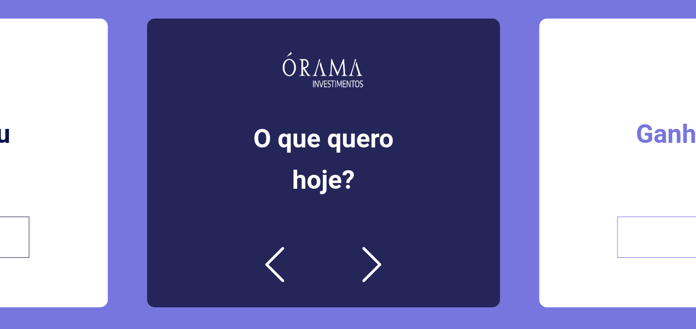
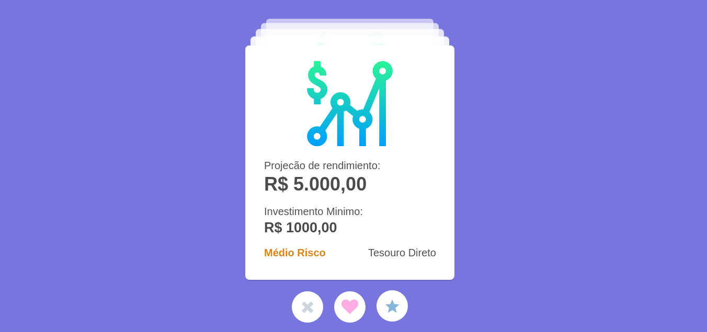
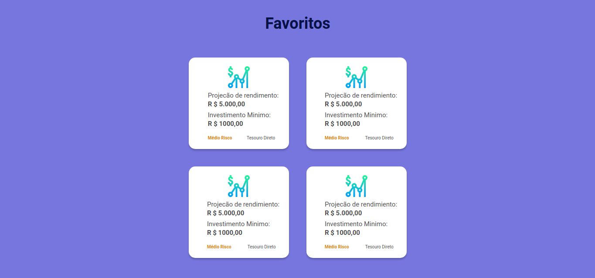

<h1 align="center">
    
</h1>

<h1 align="center">
    
</h1>

<h1 align="center">
    
</h1>

Repositório paara o projeto desenvolvido durante o [__Mega Hack 5ª edição__](https://www.megahack.com.br/) - De 09/11/20 a 15/11/20

_____
## 📢- Informações

## 🏆 Team
- __Business:__ Allyne Jullyane Romanosque Brito - allyneromanosque@gmail.com
- __Marketing/Dev. Backend:__ Atilio Héctor Goulart de Jesus - atiliogoulart@gmail.com
- __UX/Design:__ Giovanna Mascarenhas - giovanna.mascarenhas.1@gmail.com
- __Dev. Frontend Web:__ Maria Fernanda Lares Peroza - maria.lares.26@gmail.com
- __Dev. Mobile:__ Vitor Senise Furtado - vitor.senise@gmail.com

## 🤯 Desafio
Desenvolver uma forma de apresentar os serviços e produtos de investimentos de uma
forma mais amigável, simplificada e que atenda as melhores práticas de experiência do
usuário aplicadas por empresas como Netflix e Spotify. O objetivo é se comunicar com o
público de uma maneira clara e usando menos o “economês”.

- __Proposto por:__ Orama

## 💡 Idealização da Solução
Criação de uma plataforma com um sistema de gamificação em que, depois que o perfil da pessoa é
criado, nós mostramos flash cards para a pessoa com os grupos de investimentos, como, por
exemplo “Investimento em imóveis”, e, quando a pessoa escolhe 1 (um) grupo, ela entra em
um jogo de flash cards, na qual aparece cada investimento dentro desse grupo, um de cada
vez, no formato de flash card, e a pessoa arrasta pro lado direito os que ela gostar, baseado
nas informações que ela tiver daquele investimento e arrasta para o lado esquerdo os que
ela não gostar. Ao fim, aparece para ela todos os flash cards dos investimentos que ela
gostou, onde ela poderá comparar e tomar uma decisão de forma rápida e agil.

## 🔗 Links Externos
[__Pitch__](https://youtu.be/)  
[__Demonstração__](https://youtu.be/)

## 🛠️ Tecnologias

- JavaScript
- HTML
- CSS

# 🚀 Iniciar 

_Estas instruções te permitirão obter uma copia do projeto em funcionamento em sua máquina local para propósitos de desenvolvimento e provas._

## 📋 Pré-requisitos 

### Clonar o repositório
git clone https://github.com/maferlape/Desafio-Orama-equipe18

Instale a extensão Live Server.

Vá para a pasta de views e execute o arquivo principal InvestmentTypes.html com a extensão Live Server.

## 📄 Licença 

Este projeto está sob a linceça MIT. - veja o aquivo [license txt](license.txt) para detalhes

 

## 🎁 Gratidão 

* **Shawee** - *Plataforma de gerenciamento de hackathon* - [Shawee](https://shawee.io/pt/)
* **Rocketseat** - *Plataforma de Educação e Tecnologia* - [Rocketseat](https://github.com/rocketseat)

---
⌨️ desenvolvido com ❤️ 